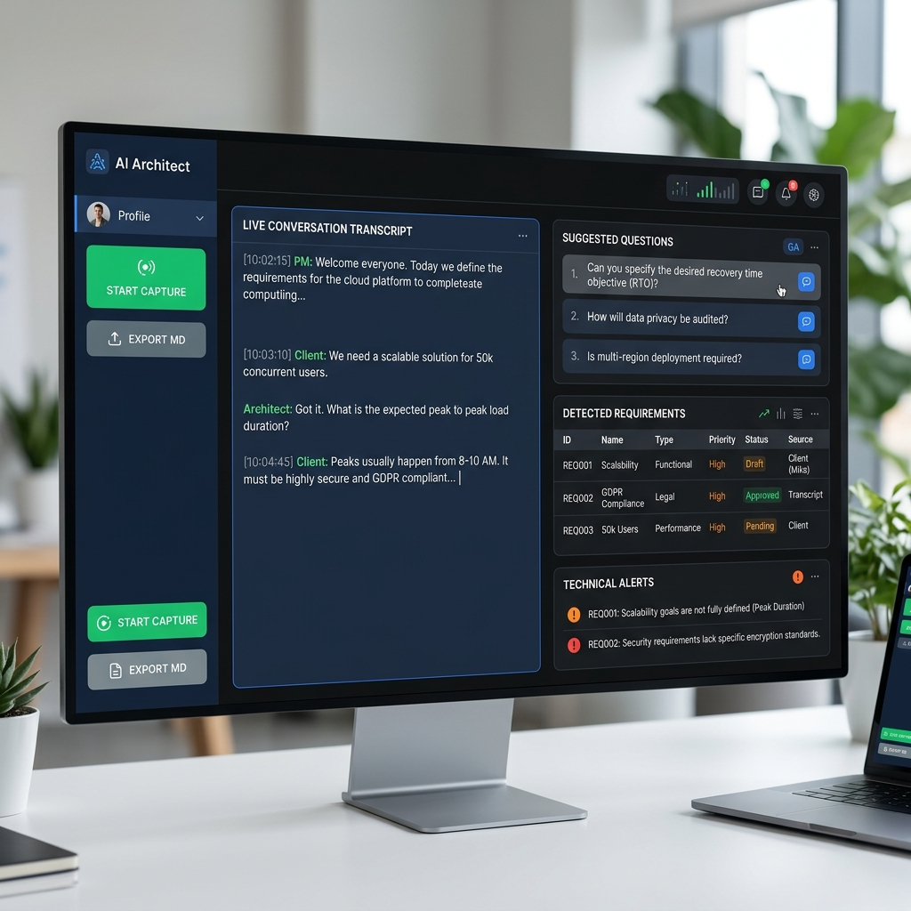

# AI Requirements Architect 🤖

Aplicación de escritorio para capturar audio en tiempo real de reuniones (Microsoft Teams, Zoom, etc.), transcribirlo automáticamente con Azure Speech Services, y analizarlo con un sistema multi-agente basado en LLMs locales (Gemma via Ollama) para identificar requisitos, vacíos de información y sugerir preguntas estratégicas.



## 🎯 Características Principales

- **Metodología BMAD Nativa**: Implementación basada en roles (Analista, Arquitecto, QA) con prompts cargados dinámicamente desde el directorio `/skills`.
- **Modos de Ejecución Inteligentes**: 
  - **Modo Deep**: Procesamiento de agentes en paralelo asíncrono para máxima velocidad sin perder profundidad.
  - **Modo Turbo**: Para sesiones de alta velocidad, un único paso del modelo analiza toda la transcripción en tiempo récord.
- **Gestión Dinámica de Preguntas**: Seguimiento en tiempo real de dudas. El sistema detecta automáticamente cuando se responde una pregunta durante la reunión y la descarta.
- **Análisis Post-Sesión (Exportación Avanzada)**: Genera un resumen ejecutivo automático, mapea las preguntas que fueron contestadas en la reunión y consolida requisitos en un documento Markdown de alta calidad.
- **Captura de Audio en Tiempo Real**: Usa dispositivos de loopback (BlackHole en macOS, VB-Cable en Windows).
- **Transcripción Automática**: Azure Speech Services con soporte robusto para español.
- **Interfaz Web**: Dashboard Streamlit interactivo con layout 60/40 (transcripción en vivo / insights).
- **Multiplataforma**: Compatible de forma nativa en macOS y Windows.

## 📁 Estructura del Proyecto

```
AIAnalyst/
├── src/
│   ├── audio_capture.py      # Captura de audio + Azure Speech
│   ├── agent_pipeline.py     # Pipeline multi-agente (Ollama)
│   └── streamlit_app.py      # Interfaz Streamlit
├── tests/
│   ├── test_audio_capture.py
│   ├── test_agent_pipeline.py
│   └── test_streamlit_ui.py
├── .env                      # Variables de entorno
├── requirements.txt
└── README.md
```

## 🚀 Instalación

### 1. Clonar/Descargar el Proyecto

```bash
cd ~/Documents/AIAnalyst
```

### 2. Crear Entorno Virtual

```bash
python3 -m venv venv
source venv/bin/activate  # macOS/Linux
# o: venv\Scripts\activate  # Windows
```

### 3. Instalar Dependencias

```bash
pip install -r requirements.txt
```

### 4. Configurar Audio Loopback

#### macOS - BlackHole (recomendado)

```bash
brew install blackhole-2ch
```

Después, configura el dispositivo de audio en macOS:
1. Abre **Audio MIDI Setup** (`Cmd+Espacio` → "Audio MIDI")
2. Crea un **Multi-Output Device** con:
   - BlackHole 2ch
   - Tus altavoces/audífonos (MacBook Pro Speakers, etc.)
3. Configura este Multi-Output como dispositivo de salida en System Settings → Sound

#### Windows - VB-Cable

1. Descarga [VB-Cable](https://vb-audio.com/Cable/)
2. Instala el driver
3. Configura el dispositivo "CABLE Output" como dispositivo de grabación por defecto

### 5. Configurar Variables de Entorno

```bash
cp .env.example .env
```

Edita `.env` con tus credenciales:

```env
# Azure Speech Services (requerido)
# Obtén en: https://portal.azure.com/ -> Speech Services -> Keys and Endpoint
AZURE_SPEECH_KEY=tu_key_aqui
AZURE_SPEECH_REGION=francecentral  # o tu región: westeurope, eastus, etc.

# Ollama (opcional - defaults a localhost)
OLLAMA_URL=http://localhost:11434

# Configuración de análisis
ANALYSIS_INTERVAL_SECONDS=30

# Dispositivo de audio (opcional - auto-detecta si no está)
# macOS: BlackHole 2ch
# Windows: CABLE Output (VB-Audio Virtual Cable)
# AUDIO_DEVICE_NAME=BlackHole 2ch
```

### 6. Instalar y Configurar Ollama

```bash
# macOS
brew install ollama

# Iniciar servidor Ollama
ollama serve

# En otra terminal, descargar el modelo
cd ~/Documents/AIAnalyst
source venv/bin/activate
ollama pull gemma3
```

**Nota**: El código usa fallback automático de `gemma4` (placeholder) a `gemma3` (disponible).

## 🎮 Uso

### Iniciar la Aplicación

```bash
cd ~/Documents/AIAnalyst
source venv/bin/activate
streamlit run src/streamlit_app.py
```

Se abrirá automáticamente en tu navegador: `http://localhost:8501`

### Flujo de Trabajo

1. **Seleccionar Dispositivo**: Elige tu dispositivo de loopback en el panel lateral
2. **Iniciar Sesión**: Click en "▶️ Iniciar Captura"
3. **Hablar**: Tu audio de Teams/Zoom se captura automáticamente
4. **Ver Análisis**: Cada 30 segundos aparecen:
   - Requisitos identificados
   - Preguntas estratégicas sugeridas
   - Alertas técnicas y dependencias
5. **Exportar**: Click en "💾 Exportar Markdown" para guardar el reporte

## 🏗️ Arquitectura del Sistema

```
┌─────────────────┐
│   Microsoft     │
│    Teams        │
└────────┬────────┘
         │ Audio del sistema
         ▼
┌─────────────────┐
│  Audio Loopback │  BlackHole (macOS) / VB-Cable (Windows)
│   (Virtual)     │
└────────┬────────┘
         │
         ▼
┌─────────────────┐
│  AudioCapture   │  sounddevice + Azure Speech SDK
│   (src/audio_)  │  Transcripción en tiempo real
└────────┬────────┘
         │ Texto cada 30s
         ▼
┌─────────────────┐
│ AgentPipeline   │
│  (src/agent_)   │
│  Transcripción (Cada 30s) │
│       ┌─────────┴─────────┐        │
│       ↓         ↓         ↓        │
│ ┌───────┐ ┌─────────┐ ┌────────┐   │
│ │Analyst│ │Architect│ │   QA   │   │ → ¡Ejecución en Paralelo (Deep Mode)!
│ └───────┘ └─────────┘ └────────┘   │
│       ↓         ↓         ↓        │
│       └─────────┬─────────┘        │
└────────┬────────┘
         │ Insights
         ▼
┌─────────────────┐
│  Streamlit UI   │
│ (src/streamlit_ │  60% transcripción | 40% insights
│     _app.py)    │  Exportación Markdown
└─────────────────┘
```

## 🧪 Tests

El proyecto sigue **Specification-Driven Development (SDD)**. Todos los tests pasan:

```bash
# Ejecutar todos los tests
pytest tests/ -v

# Tests específicos
pytest tests/test_audio_capture.py -v
pytest tests/test_agent_pipeline.py -v
pytest tests/test_streamlit_ui.py -v
```

**Estado actual**: ✅ 47 passed, 4 skipped (requieren setup manual: BlackHole, Azure Key, Ollama)

## 📝 Especificaciones (SDD)

Las especificaciones completas están en `specs.md`:

- **Audio Capture**: Detección de dispositivos, buffer 30s, callbacks
- **Pipeline Multi-Agente**: 3 llamadas secuenciales, <10s latencia, fallback Gemma 3
- **UI Streamlit**: Layout 60/40, controles en tiempo real, export Markdown
- **Persistencia**: Exportación estructurada a Markdown
- **Multiplataforma**: macOS + Windows

## 🔧 Troubleshooting

### Error: "No se encontró dispositivo de audio"

```bash
# Listar dispositivos disponibles
python -c "from src.audio_capture import list_audio_devices; print(list_audio_devices())"
```

Verifica que BlackHole/VB-Cable esté instalado y configurado.

### Error: "Azure Speech credentials not found"

Asegúrate de que `.env` existe y tiene `AZURE_SPEECH_KEY` configurado.

### Error: "Cannot connect to Ollama"

```bash
# Verificar que Ollama está corriendo
curl http://localhost:11434/api/tags

# Si no responde, iniciar servidor
ollama serve
```

### Error de permisos en macOS

```bash
sudo chown -R $(whoami) /opt/homebrew
```

## 📄 Formato de Exportación Markdown

```markdown
# Sesión de Requisitos - 2026-05-06 12:34:56

## Resumen Ejecutivo
- **Duración:** 15 minutos
- **Requisitos identificados:** 3
- **Preguntas pendientes:** 5
- **Alertas técnicas:** 2

## Requisitos Funcionales
| ID | Descripción | Tipo |
|----|-------------|------|
| RF1 | Login con Google OAuth | auth |

## Preguntas Pendientes (por prioridad)
1. ¿Cuántos usuarios concurrentes?

## Alertas Técnicas
- Dependencia: OAuth 2.0 requerido

## Transcripción Completa
[12:00:01] El cliente quiere login con Google...
```

## 🔐 Seguridad

- **Azure Speech Key**: Guardada solo en `.env` (no en git)
- **Datos de audio**: Procesados en tiempo real, no se almacenan
- **Transcripciones**: Guardadas localmente en `~/AIAnalyst/sessions/`
- **LLM local**: Gemma corre 100% local via Ollama (sin datos a la nube)

## 📚 Recursos

- [Azure Speech Services](https://docs.microsoft.com/azure/cognitive-services/speech-service/)
- [Ollama](https://ollama.com/)
- [Streamlit](https://docs.streamlit.io/)
- [BlackHole](https://github.com/ExistentialAudio/BlackHole)
- [VB-Cable](https://vb-audio.com/Cable/)

## 🛣️ Roadmap

- [x] Captura de audio con Azure Speech
- [x] Pipeline multi-agente con Ollama
- [x] UI Streamlit con layout 60/40
- [x] Exportación Markdown
- [ ] Soporte para múltiples idiomas
- [ ] Integración con calendario (Google Calendar, Outlook)
- [ ] Histórico de sesiones con búsqueda
- [ ] Dashboard de métricas de reuniones

## 🤝 Contribuir

Este es un proyecto personal, pero las sugerencias son bienvenidas.

## 📄 Licencia

MIT License - Uso personal y educativo.

---

**Desarrollado con ❤️ para reuniones de requisitos más productivas.**
